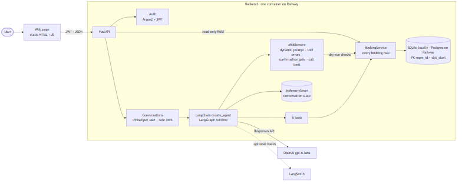
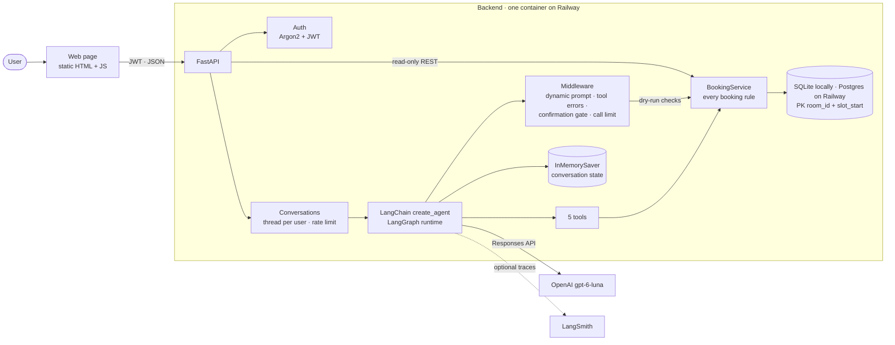
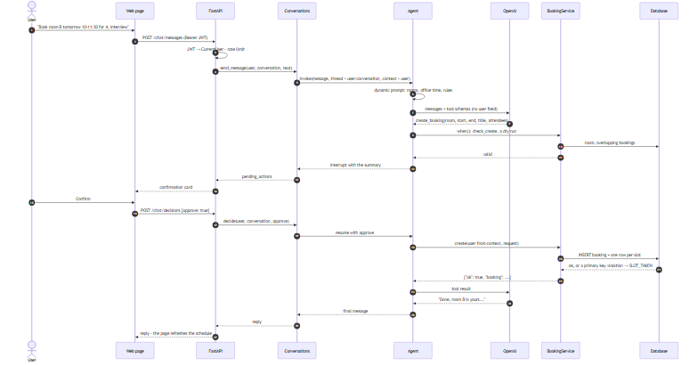
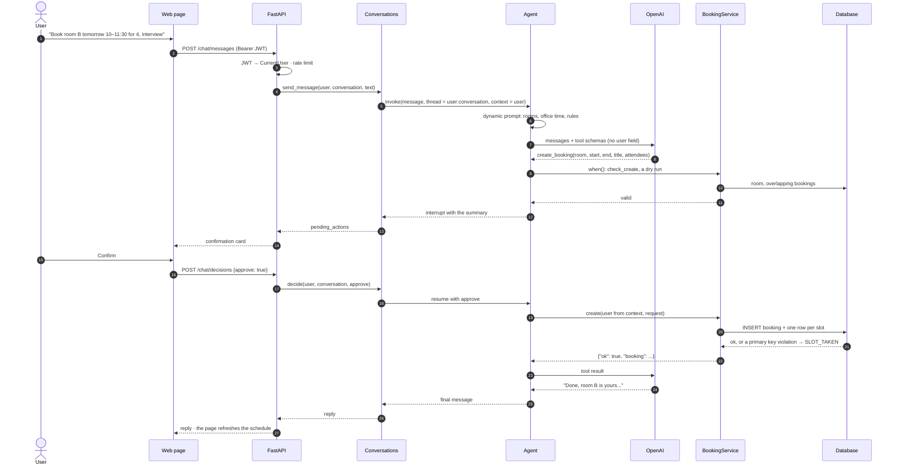

# Architecture

## Components

## One message, from question to answer

## Middleware order

| Middleware | Hook | What it does |
|---|---|---|
| `system_prompt` (`@dynamic_prompt`) | before each model call | rooms, capacities, office date and time, rules, the user's name |
| `booking_errors_as_tool_results` (`@wrap_tool_call`) | around each tool | `BookingError` → structured tool result; any other exception → `INTERNAL_ERROR`, logged |
| `HumanInTheLoopMiddleware` | after each model call | pauses `create_booking` / `cancel_booking` only when a dry run on the schema-validated arguments passes |
| `ModelCallLimitMiddleware(run_limit=6)` | per user message | stops a runaway loop |

## Where each guarantee lives

| Guarantee | Enforced by |
|---|---|
| No double booking, even concurrently | primary key `(room_id, slot_start)` |
| Capacity, 30-minute alignment, 3 hours, business hours, title | `BookingService.check_create` |
| Only the owner cancels | `BookingService.check_cancel` with the user from runtime context |
| Nobody acts as another user | the user is never a tool argument; threads are keyed by user on the server |
| No write without the user's consent | `HumanInTheLoopMiddleware` + `/chat/decisions` |
| No cross-user prompt injection through titles | schedules hide other users' titles |
